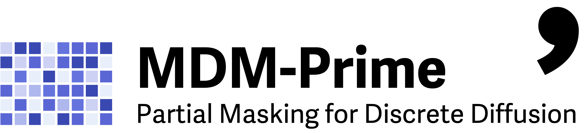
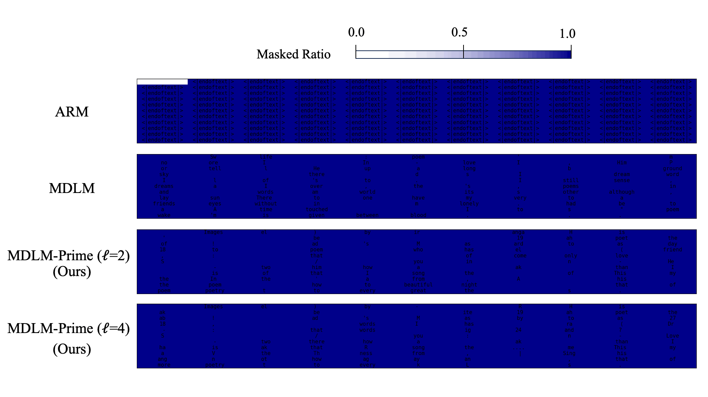

<div align="center">
<br>

</div>

<br>
<p align="center">
<a href="https://arxiv.org/abs/2505.18495"></a>
<a href="https://huggingface.co/chen-hao-chao/mdm-prime"></a>
<a href="https://hub.docker.com/r/chenhaochao/mdm-prime"></a>
<a href="https://hub.docker.com/r/chenhaochao/mdlm-prime"></a><br>
<a href="https://paperswithcode.com/sota/language-modelling-on-openwebtext?p=beyond-masked-and-unmasked-discrete-diffusion"></a><br>
<a href="https://paperswithcode.com/sota/image-generation-on-cifar-10?p=beyond-masked-and-unmasked-discrete-diffusion"></a><br>
<a href="https://paperswithcode.com/sota/image-generation-on-imagenet-32x32?p=beyond-masked-and-unmasked-discrete-diffusion"></a>
</p>

## 🏃‍➡️ Coming Soon

Thank you for your interest in our project! We are currently preparing and testing the code and will be releasing it soon.

## What will be Included

This repository contains the code implementation of the experiments presented in the paper [*Beyond Masked and Unmasked: Discrete Diffusion Models via Partial Masking*](https://arxiv.org/abs/2505.18495).

- :whale: **Docker support** for enhanced reproducibility
- :cd: **Pretrained weights** for inference and evaluation
- :mag: **Sampling process visualizations** to understand model behavior
- :microscope: **Code for all experiments** in our paper:
  - Toy experiments on synthetic data
  - Text generation on OpenWebText
  - Image generation on CIFAR-10 & ImageNet-32

## Overview

### Toy Examples

- **Dataset**: 2D Synthetic Dataset  
- **Folder**: [mdm-prime/toy](/toy)
- <details> <summary> <strong>Demo</strong> (click me) </summary>  </details>

### Text Generation
- **Dataset**: OpenWebText (OWT)
- **Folder**: [mdm-prime/text](/text)
- <details> <summary> <strong>Demo</strong> (click me) </summary>  </details>


### Image Generation
- **Dataset**: CIFAR-10, ImageNet-32
- **Folder**: [mdm-prime/image](/image)
- <details> <summary> <strong>Demo</strong> (click me) </summary>  </details>

## License
This code implementation is developed based on the following repositories.

- [kuleshov-group/mdlm](https://github.com/kuleshov-group/mdlm) (at commit `3ecb6dc`), licensed under the `Apache-2.0` license.
- [facebookresearch/flow_matching](https://github.com/facebookresearch/flow_matching) (at commit `47c4396`), licensed under the `CC BY-NC 4.0` license.

Further changes based on this repository are licensed under the `Apache-2.0` and `CC BY-NC 4.0` licenses.


## Citing MDM-Prime

If you find our code useful, please consider citing our paper.

```bib
@article{chao2025mdmprime,
      title={{Beyond Masked and Unmasked: Discrete Diffusion Models via Partial Masking}}, 
      author={Chen-Hao Chao, Wei-Fang Sun, Hanwen Liang, Chun-Yi Lee, Rahul G. Krishnan},
      journal={\tt arXiv:2505.18495 [cs.LG]},
      year={2025},
}
```
