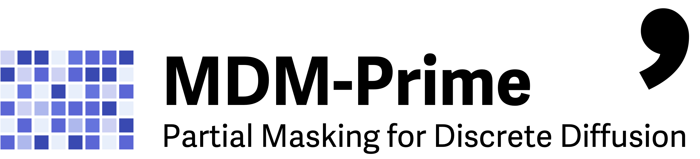
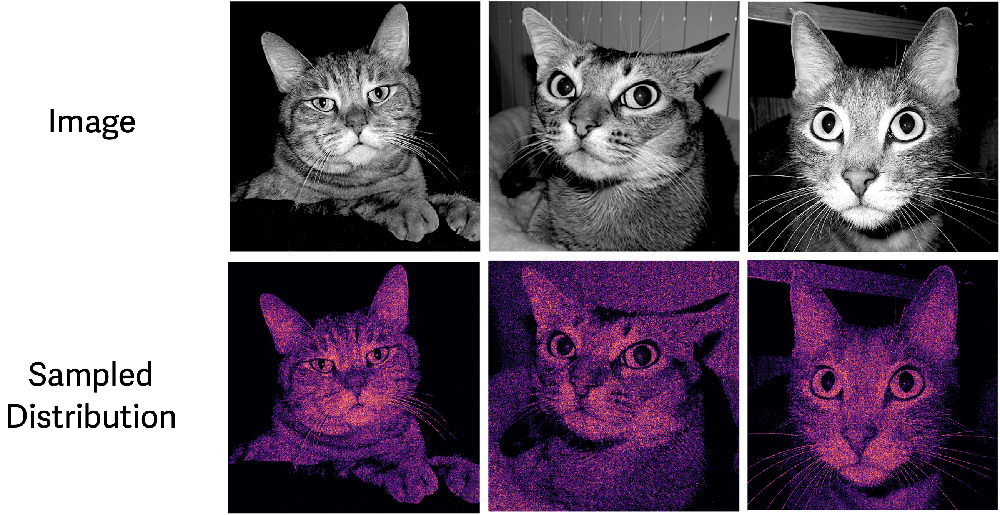
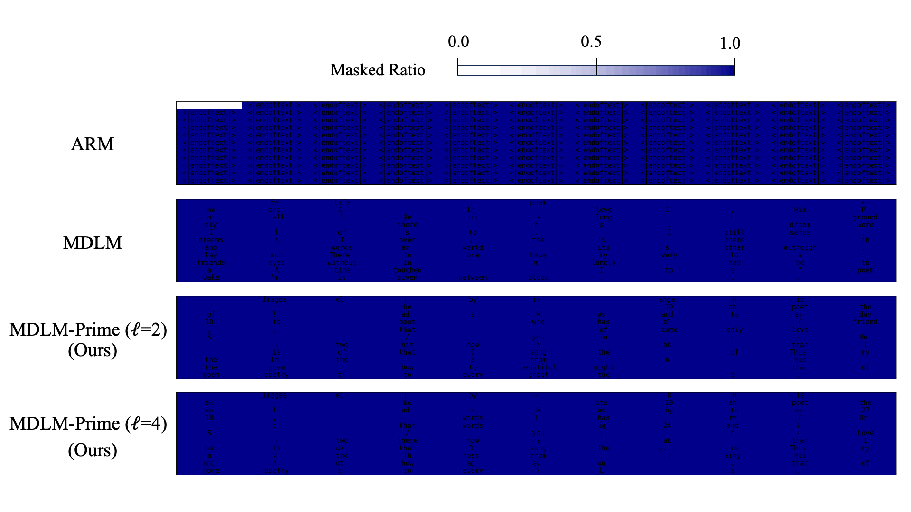

<div align="center">
<br>

</div>

<br>
<p align="center">
<a href="https://arxiv.org/abs/2505.18495"></a>
<a href="https://huggingface.co/chen-hao-chao/mdm-prime"></a>
<a href="https://hub.docker.com/r/chenhaochao/mdm-prime"></a>
<a href="https://hub.docker.com/r/chenhaochao/mdlm-prime"></a>
<a href="https://x.com/chenhao_chao/status/1935699633654931464"></a><br>

## ⚠️ Notice: Perplexity Evaluation Error

We have identified a serious error in the perplexity evaluation results. Please see our [errata note](https://chen-hao-chao.github.io/dependency-breaks-validity/) for more details. A corrected implementation will be released soon.

#### What remains valid

The following results are unaffected and the code can still be used to reproduce them:

- Claims about idle steps (Fig. 1)
- Sample quality comparisons (Tables 3, 4)

#### What is affected

The NLL results for MDM-Prime (Tables 1, 2) do not represent a real improvement and may be overestimated.

We apologize for any inconvenience this may cause.

## What’s Inside

This repository contains the code implementation of the experiments presented in the paper [*Beyond Masked and Unmasked: Discrete Diffusion Models via Partial Masking*](https://arxiv.org/abs/2505.18495).

- :whale: **Docker environments** for easy installation
- 🤗 **Pretrained weights** for inference and evaluation
- :chart_with_downwards_trend: **Weights and Biases logs** for enhanced reproducibility
- :microscope: **Code for all experiments** in our paper:
  - Toy experiments on synthetic data
  - Text generation on OpenWebText
  - Image generation on CIFAR-10 & ImageNet-32


## News
- :notebook: **[May 1, 2026]** Released [errata note](https://chen-hao-chao.github.io/dependency-breaks-validity/). The current NLL/Perplexity evaluation is incorrect.
- 📅 **[Mar 17, 2026]** Released [MDM-Prime-v2](https://arxiv.org/abs/2603.16077). Check out the implementation in [mdm-prime/text](/text).
- 🎉 **[Sep 18, 2025]** Our paper has been accepted to NeurIPS 2025.


## Overview

### Toy Examples

- **Dataset**: 2D Synthetic Dataset  
- **Folder**: [mdm-prime/toy](/toy)
- <details> <summary> <strong>Demo</strong> (click me) </summary>  </details>

### Text Generation
- **Dataset**: OpenWebText (OWT)
- **Folder**: [mdm-prime/text](/text)
- <details> <summary> <strong>Demo</strong> (click me) </summary>  </details>


### Image Generation
- **Dataset**: CIFAR-10, ImageNet-32
- **Folder**: [mdm-prime/image](/image)
- <details> <summary> <strong>Demo</strong> (click me) </summary>  </details>

## License
This code implementation is developed based on the following repositories.

- [kuleshov-group/mdlm](https://github.com/kuleshov-group/mdlm) (at commit `3ecb6dc`), licensed under the `Apache-2.0` license.
- [facebookresearch/flow_matching](https://github.com/facebookresearch/flow_matching) (at commit `c056dd6`), licensed under the `CC BY-NC 4.0` license.

Further changes based on this repository are licensed under the `Apache-2.0` and `CC BY-NC 4.0` licenses.


## Citing MDM-Prime

If you find this code implementation useful, please consider citing our paper.

```bib
@inproceedings{chao2025mdmprime,
      title = {{Beyond Masked and Unmasked: Discrete Diffusion Models via Partial Masking}}, 
      author = {Chen-Hao Chao, Wei-Fang Sun, Hanwen Liang, Chun-Yi Lee, Rahul G. Krishnan},
      booktitle = {Proceedings of the Conference on Neural Information Processing Systems (NeurIPS)},
      year = {2025},
}
```
