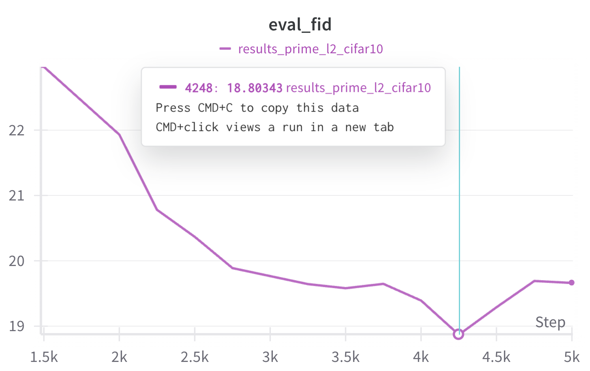

# Image Generation Experiments

[](https://arxiv.org/abs/2505.18495) [](https://huggingface.co/chen-hao-chao/mdm-prime) [](https://hub.docker.com/r/chenhaochao/mdm-prime)<br>

This folder contains the code implementation of the image generation experiments presented in **Section 4.2** of [our paper](https://arxiv.org/abs/2505.18495).


## Install Dependencies

You can choose to lunch our pre-built docker image or manually install the dependencies via conda:

### :whale: Docker

1. Pull our pre-built docker image:
```bash
docker pull chenhaochao/mdm-prime:latest
```
or build a docker image locally through the following command:

```bash
docker build -t mdm-prime:latest .
```

2. Launch the docker image at `mdm-prime/image` through the following commands:
```bash
docker run -v $(pwd):/app --rm -it --gpus all --ipc=host chenhaochao/mdm-prime:latest
```
    
### :snake: Conda
    
- Install conda environment:

```bash
# Create conda environment
conda env create -f environment.yml
conda activate mdm-prime
# Install default dependencies via pip
pip install -r requirements.txt
```

- **Note**: The toy and image experiments share the same dependencies. You can skip this installation step if the dependencies are already installed.

<details>
<summary><strong>Possible Error Messages & Solutions</strong></summary>

**Error**. When executing `pip install -r requirements.txt`:
```bash
Building wheels for collected packages: LibCST
  Building wheel for LibCST (pyproject.toml) ... error
  error: subprocess-exited-with-error
  × Building wheel for LibCST (pyproject.toml) did not run successfully.
  │ exit code: 1
  ╰─> [435 lines of output]
```
**Solution**. Install `sympy` with the following command and then install `requirements.txt` again:
```
pip install sympy==1.13.1
```

</details>

## Datasets

CIFAR-10 will be automatically downloaded when running the training commands. ImageNet-32 can be manually downloaded via [this link](https://image-net.org/download-images):

|  |
| - |

Unzip the downloaded files and place the results at `${data_path}` as follows:

```
${data_path}/
├── train/
|   ├── train_data_batch_1
|   ├── train_data_batch_2
|   ├── ...
├── val/
|   ├── val_data
```

Specify `--data_path ${data_path}` when using `--dataset imagenet` in both the [training](#training) and [evaluation](#evaluation) commands.

## Commands

### Training

:pushpin: **MDM**

```bash
torchrun --standalone --nnodes=1 --nproc_per_node=8 main.py \
         --dataset cifar10 --use_ema --output_dir results_mdm_cifar10 --epochs 2501 \
         --carry_over --temperature_parameters -0.15 1.0 1.0 \
         --use_corrector_step --corrector_parameters 12.0 2.0 0.75 \
         --use_timestep_scheduler --timestep_parameters 1.0 0.0 0.0
```

- **Torchrun Setups:** ([link](https://docs.pytorch.org/docs/stable/elastic/run.html))
    - `--nnodes`: number of nodes.
    - `--nproc_per_node`: number of processes per node (i.e., number of available GPUs)

- **Arguments:**
    - `--dataset`: `cifar10` or `imagenet`. (default: `cifar10`)
    - `--use_ema`: whether to use exponential moving average (EMA) (default: `False`)
    - `--output_dir`: path to the working directory. (default: `/app/output_dir`)
    - `--epochs`: number of training epochs. (default: `8001`)
    - `--carry_over`: whether to use the carry-over parameterization during sampling. (default: `False`)
    - `--temperature_parameters`: temperature for sharpening the softmax distribution. (default: `1.0 0.0 0.0`)
    - `--use_corrector_step`: whether to add corrector steps. (default: `False`)
    - `--corrector_parameters`: temperature for controlling the corrector steps. (default: `1.0 0.0 0.0`)
    - `--use_timestep_scheduler`: whether to adjust sampling stride size. (default: `False`)
    - `--timestep_parameters`: temperature for controlling the sampling stride size. (default: `1.0 0.0 0.0`)

- (Optional) **Weights & Biases** ([link](https://wandb.ai/site/))
    - Uploading the training results to [Weights & Biases](https://wandb.ai/site/) by specifying `--wandb_project` (i.e., project name), `--wandb_key` (i.e., your wandb API key), and `--wandb_entity` (i.e., your account). Example:
```
--wandb --wandb_project results_mdm_cifar10 --wandb_key ${wandb_API_key} --wandb_entity ${wandb_account}
```

:pushpin: **MDM-Prime**

```bash
torchrun --standalone --nnodes=1 --nproc_per_node=8 main.py \
         --dataset cifar10 --use_ema --output_dir results_prime_l2_cifar10 --target_length 2 --epochs 4251 \
         --carry_over --temperature_parameters -0.2 2.0 1.0 \
         --use_corrector_step --corrector_parameters 16.0 2.0 0.75 \
         --use_timestep_scheduler --timestep_parameters 1.0 1.7 0.0
```
- **Arguments:**
    - `--target_length`: number of sub-tokens, i.e., $\ell$. (default: `1`)

:pushpin: **MDM-Mixture**

```bash
torchrun --standalone --nnodes=1 --nproc_per_node=8 main.py \
         --dataset cifar10 --use_ema --output_dir results_mdm_mixture_cifar10 --epochs 2501 \
         --use_uniform_mixture --mixture_classes 4 \
         --carry_over --temperature_parameters -0.15 1.0 1.0 \
         --use_corrector_step --corrector_parameters 12.0 2.0 0.75 \
         --use_timestep_scheduler --timestep_parameters 1.0 0.0 0.0
```

- **Arguments:**
    - `--use_uniform_mixture`: whether to use a uniform mixture model. (default: `False`)
    - `--mixture_classes`: number of distinct labels for the mixture distribution. (default: `4`)

:pushpin: **MDM-Prime with Super-tokens**

```bash
torchrun --standalone --nnodes=1 --nproc_per_node=8 main.py \
                 --dataset cifar10 --use_ema --output_dir results_prime_supertoken_cifar10 --epochs 2251 \
                 --super_token --vocab_size 4096 --seq_length 2048 \
                 --schedule_n 2.0 --temperature_parameters -0.15 1.0 1.0 \
                 --use_corrector_step --corrector_parameters 6.0 1.0 0.75 \
                 --use_timestep_scheduler --timestep_parameters 1.0 0.0 0.0
```

- **Arguments:**
    - `--super_token`: whether to use super-tokens. (default: `False`)
    - `--vocab_size`: number of classes that can be taken by a token, i.e., $C$. (default: `256`)
    - `--seq_length`: sequence length of the data, i.e., $L$. (default: `3072`)
    - `--schedule_n`: power of the polynomial scheduler. (default: `3.0`)

### Evaluation

:pushpin: **FID Evaluation**

1. Generate 50,000 samples using `parallel_sampling.py`:

```bash
python parallel_sampling.py --dataset cifar10 --use_ema --target_length 2 --start_epoch 4250 \
                            --split_size 6250 --num_gpus 8 --sampling_all \
                            --batch_size 100 --output_dir results_prime_l2_cifar10 \
                            --storage_path /app/results_ray \
                            --resume results_prime_l2_cifar10/checkpoint-4249.pth \
                            --carry_over --temperature_parameters -0.2 2.0 1.0 \
                            --use_corrector_step --corrector_parameters 16.0 2.0 0.75 \
                            --use_timestep_scheduler --timestep_parameters 1.0 1.7 0.0
```

- **Arguments:**
    - `--split_size`: number of samples generated by the model deployed on a single GPU. (default: `6250`)
    - `--num_gpus`: number of available GPUs (ensure that `split_size` $\times$ `num_gpus` = 50,000). (default: `8`)
    - `--sampling_all`: flag indicating FID evaluation mode, which modifies the output folder name. (default: `False`)
    - `--batch_size`: sampling batch size. (default: `64`)
    - `--storage_path`: path to the directory for saving [Ray Tune](https://docs.ray.io/en/latest/tune/index.html) log. (default: `/app/results_ray`)
    - `--resume`: path to the checkpoint file for evaluation. (default: ` `)

2. Calculate FID of the generated samples using `eval.py`:

```bash
python eval.py --mode eval_fid --dataset cifar10 --eval_all \
               --batch_size 100 --output_dir results_prime_l2_cifar10 \
               --carry_over --temperature_parameters -0.2 2.0 1.0 \
               --use_corrector_step --corrector_parameters 16.0 2.0 0.75 \
               --use_timestep_scheduler --timestep_parameters 1.0 1.7 0.0
```

- **Arguments:**
    - `--mode`: `eval_fid`, `sample_data`, `imputation`, or `compute_nll_bpd`. (default: `eval_fid`)
    - `--eval_all`: flag indicating FID evaluation mode, which modifies the output folder name. (default: `False`)

### Sampling

:pushpin: **Unconditional Sampling**

```bash
python eval.py --mode sample_data --dataset cifar10 --use_ema --target_length 2 --start_epoch 4250 \
               --split_size 100 --batch_size 100 --nfe 256 \
               --output_dir results_prime_l2_cifar10 \
               --resume results_prime_l2_cifar10/checkpoint-4249.pth \
               --carry_over --temperature_parameters -0.2 2.0 1.0 \
               --use_corrector_step --corrector_parameters 16.0 2.0 0.75 \
               --use_timestep_scheduler --timestep_parameters 1.0 1.7 0.0
```

- **Arguments:**
    - `--nfe`: number of function evaluations. (default: `512`)

:pushpin: **Imputation**

```bash
python eval.py --mode imputation --dataset cifar10 --use_ema --target_length 8 --start_epoch 1500 \
               --batch_size 80 --fid_samples 400 --nfe 256 \
               --output_dir results_prime_l8_cifar10 \
               --resume results_prime_l8_cifar10/checkpoint-1499.pth \
               --carry_over --subtoken_index 0 6
```

- **Arguments:**
    - `--fid_samples`: total number of samples. (default: `2000`)
    - `--subtoken_index`: indices (i.e., $j$) of sub-tokens to be fixed during sampling. (default: `0`)

## Pretrained Weights and Hyperparameters

The following tables (click the toggle-down buttons) present the pretrained weights and the optimal training and sampling configurations, tuned via grid search based on the relative FID computed from 2,000 generated samples.

<details>
<summary><strong>CIFAR-10</strong> (C10)</summary>

| Dataset | Model | $\ell$ | Weight | `epochs` | FID | `nfe` | `temperature_parameters` | `corrector_parameters` | `timestep_parameters` | `carry_over` |
| - | - | - | - | - | - | - | - | - | - | - |
| `C10`  | Prime     | 2/3 | [🤗 Link](https://huggingface.co/chen-hao-chao/mdm-prime/blob/main/image/cifar10/results_prime_supertoken_cifar10/checkpoint-2249.pth) | 2250 | 6.29  | 512 | -0.2 0.75 1.0 | 4.0 0.5 1.75  | 1.0 0.0 0.0 | False  |
|        |           |     |          |      | 7.07  | 256 | -0.15 1.0 1.0 | 6.0 1.0 0.75  | 1.0 0.0 0.0 | False  |
|        |           |     |          |      | 12.78 | 128 | -0.3 2.0 1.0  | 1.0 2.0 0.75  | 1.0 0.0 0.0 | False  |
|        | MDM       | 1 | [🤗 Link](https://huggingface.co/chen-hao-chao/mdm-prime/blob/main/image/cifar10/results_mdm_cifar10/checkpoint-2499.pth) | 2500 | 4.66  | 512 | -0.15 1.0 1.0 | 12.0 2.0 0.75 | 1.0 0.0 0.0 | True  |
|        |           |   |          |      | 5.00  | 256 | -0.1 1.0 1.0  | 12.0 1.0 0.5  | 1.0 0.0 0.0 | True  |
|        |           |   |          |      | 7.55  | 128 | -0.2 2.0 1.0  | 2.0 0.25 0.5  | 1.0 0.9 0.0 | True  |
|        | Prime     | 2 | [🤗 Link](https://huggingface.co/chen-hao-chao/mdm-prime/tree/main/image/cifar10/results_prime_l2_cifar10) | 4250 | 3.26  | 512 | -0.2 2.0 1.0  | 16.0 2.0 0.75 | 1.0 1.7 0.0 | True  |
|        |           |   |          |      | 3.73  | 256 | -0.4 2.0 1.0  | 12.0 2.0 1.25 | 1.0 0.0 0.0 | True  |
|        |           |   |          |      | 5.22  | 128 | -0.2 1.0 1.0  | 6.0 2.0 1.25  | 1.0 0.8 0.0 | True  |
|        | Prime     | 3 | [🤗 Link](https://huggingface.co/chen-hao-chao/mdm-prime/blob/main/image/cifar10/results_prime_l3_cifar10/checkpoint-3499.pth) | 3500 | 4.81  | 512 | -0.1 3.5 1.0  | 18.0 1.0 0.75 | 1.0 1.1 0.0 | False |
|        |           |   |          |      | 5.01  | 256 | -0.3 3.0 1.0  | 20.0 2.0 0.75 | 1.0 0.8 0.0 | False |
|        |           |   |          |      | 6.07  | 128 | -0.2 1.0 1.0  | 2.0 1.0 0.0   | 1.0 0.8 0.0 | False |
|        | Prime     | 4 | [🤗 Link](https://huggingface.co/chen-hao-chao/mdm-prime/blob/main/image/cifar10/results_prime_l4_cifar10/checkpoint-2499.pth) | 2500 | 5.04  | 512 | -0.2 3.0 1.0  | 16.0 1.0 1.0  | 1.0 0.0 0.0 | False |
|        |           |   |          |      | 5.08  | 256 | -0.2 2.0 1.0  | 18.0 2.0 1.0  | 1.0 0.8 0.0 | False |
|        |           |   |          |      | 6.33  | 128 | -0.2 1.0 1.0  | 6.0 2.0 0.75  | 1.0 0.0 0.0 | False |
|        | Prime     | 8 | [🤗 Link](http://huggingface.co/chen-hao-chao/mdm-prime/blob/main/image/cifar10/results_prime_l8_cifar10/checkpoint-1499.pth) | 1500 | 7.31  | 512 | -0.15 3.0 1.0 | 20.0 0.5 0.75 | 1.0 0.0 0.0 | True  |
|        |           |   |          |      | 8.42  | 256 | -0.35 3.0 1.0 | 6.0 1.0 0.5   | 1.0 0.0 0.0 | True  |
|        |           |   |          |      | 11.89 | 128 | 1.0 0.0 0.0   | 6.0 2.0 1.25  | 1.0 0.0 0.0 | True  |

</details>

<details>
<summary><strong>ImageNet-32</strong> (I32)</summary>

| Dataset | Model | $\ell$ | Weight | `epochs` | FID | `nfe` | `temperature_parameters` | `corrector_parameters` | `timestep_parameters` | `carry_over` |
| - | - | - | - | - | - | - | - | - | - | - |
| `I32`  | Prime     | 2/3 | [🤗 Link](https://huggingface.co/chen-hao-chao/mdm-prime/blob/main/image/imagenet32/results_prime_supertoken_imagenet32/checkpoint-599.pth) | 600  | 9.38  | 512  | 1.0 0.0 0.0   | 6.0 1.0 0.75  | 1.0 0.0 0.0 | False  |
|        |           |     |          |      | 10.21 | 256  | 1.0 0.0 0.0   | 2.0 2.0 0.5   | 1.0 0.0 0.0 | False  |
|        |           |     |          |      | 10.48 | 128  | 1.0 0.0 0.0   | 1.0 2.0 1.25  | 1.0 0.0 0.0 | False  |
|        | MDM       | 1 | [🤗 Link](https://huggingface.co/chen-hao-chao/mdm-prime/blob/main/image/imagenet32/results_mdm_imagenet32/checkpoint-674.pth) | 675  | 7.91  | 1024 | 1.0 0.0 0.0   | 6.0 1.0 1.0   | 1.0 0.0 0.0 | True  | 
|        |           |   |          |      | 8.12  | 512  | 1.0 0.0 0.0   | 12.0 1.0 0.5  | 1.0 0.0 0.0 | True  |
|        |           |   |          |      | 8.24  | 256  | 1.0 0.0 0.0   | 2.0 0.25 0.5  | 1.0 0.0 0.0 | True  |
|        |           |   |          |      | 9.55  | 128  | -0.1 2.0 1.0  | 2.0 0.5 1.0   | 1.0 0.8 0.0 | True  | 
|        | Prime     | 2 | [🤗 Link](https://huggingface.co/chen-hao-chao/mdm-prime/blob/main/image/imagenet32/results_prime_l2_imagenet32/checkpoint-974.pth) | 975  | 6.98  | 1024 | 1.0 0.0 0.0   | 6.0 2.0 1.0   | 1.0 0.0 0.0 | True  | 
|        |           |   |          |      | 7.31  | 512  | 1.0 0.0 0.0   | 6.0 2.0 1.0   | 1.0 0.0 0.0 | True  |
|        |           |   |          |      | 7.64  | 256  | -0.2 2.0 1.0  | 1.0 2.0 0.75  | 1.0 0.0 0.0 | True  |
|        |           |   |          |      | 7.85  | 128  | -0.2 1.0 1.0  | 0.0 0.0 0.0   | 1.0 0.0 0.0 | True  |
|        | Prime     | 3 | [🤗 Link](https://huggingface.co/chen-hao-chao/mdm-prime/blob/main/image/imagenet32/results_prime_l3_imagenet32/checkpoint-1049.pth) | 1050 | 9.33  | 512  | -0.1 3.0 1.0  | 2.0 2.5 1.25  | 1.0 1.3 0.0 | False |
|        |           |   |          |      | 9.68  | 256  | -0.1 0.75 1.0 | 2.0 2.5 0.75  | 1.0 0.7 0.0 | False |
|        |           |   |          |      | 9.74  | 128  | -0.1 0.75 1.0 | 2.0 2.5 0.75  | 1.0 0.7 0.0 | False |
|        | Prime     | 4 | [🤗 Link](https://huggingface.co/chen-hao-chao/mdm-prime/blob/main/image/imagenet32/results_prime_l4_imagenet32/checkpoint-899.pth) | 900  | 10.33 | 512  | 1.0 0.0 0.0   | 12.0 2.0 1.25 | 1.0 1.1 0.0 | False |
|        |           |   |          |      | 10.56 | 256  | -0.1 2.0 1.0  | 2.0 0.5 0.75  | 1.0 1.3 0.0 | False |
|        |           |   |          |      | 10.79 | 128  | -0.2 1.0 1.0  | 1.0 2.0 1.0   | 1.0 0.0 0.0 | False |
|        | Prime     | 8 | [🤗 Link](https://huggingface.co/chen-hao-chao/mdm-prime/blob/main/image/imagenet32/results_prime_l8_imagenet32/checkpoint-649.pth) | 650  | 13.32 | 512  | -0.2 3.0 1.0  | 2.0 2.0 1.0   | 1.0 0.0 0.0 | True  |
|        |           |   |          |      | 13.61 | 256  | -0.3 2.0 1.0  | 0.0 0.0 0.0   | 1.0 0.0 0.0 | True  |
|        |           |   |          |      | 14.12 | 128  | -0.2 1.0 1.0  | 1.0 1.0 1.25  | 1.0 0.6 0.0 | True  |

</details>

The training of each model is early stopped based on the best relative FID. For instance, MDM-Prime ($\ell=2$) shows degraded FID performance when trained beyond 4,250 steps on CIFAR-10:

||
|-|
<br>

:pushpin: **Example Usage of Pretrained Weights**

Pass `--from_huggingface` and set `--resume image/${dataset}/${setup_dir}/checkpoint-${epoch}.pth` to download the checkpoint from our huggingface repository.

**Example.** Resume Training from a Pretrained MDM-Prime ($\ell=2$)

```bash
torchrun --standalone --nnodes=1 --nproc_per_node=8 main.py \
         --dataset cifar10 --use_ema --output_dir results_prime_l2_cifar10 --target_length 2 --epochs 8001 \
         --carry_over --temperature_parameters -0.2 2.0 1.0 \
         --use_corrector_step --corrector_parameters 16.0 2.0 0.75 \
         --use_timestep_scheduler --timestep_parameters 1.0 1.7 0.0 \
         --from_huggingface --start_epoch 4250 \
         --cache_dir /app/huggingface_cache \
         --resume image/cifar10/results_prime_l2_cifar10/checkpoint-4249.pth
```

**Example.** Sampling using MDM-Prime ($\ell=2$)

```bash
python eval.py --mode sample_data --dataset cifar10 --use_ema --target_length 2 \
               --split_size 100 --batch_size 100 --nfe 256 \
               --output_dir results_prime_l2_cifar10 \
               --carry_over --temperature_parameters -0.2 2.0 1.0 \
               --use_corrector_step --corrector_parameters 16.0 2.0 0.75 \
               --use_timestep_scheduler --timestep_parameters 1.0 1.7 0.0 \
               --from_huggingface --start_epoch 4250 \
               --cache_dir /app/huggingface_cache \
               --resume image/cifar10/results_prime_l2_cifar10/checkpoint-4249.pth
```

:pushpin: **Manually Download the Pretrained Weights**

Execute the following python code, and the downloaded files will appear in your huggingface cache directory (e.g., `~/.cache/huggingface/hub`):
```python
from huggingface_hub import hf_hub_download

checkpoint_path = hf_hub_download(
    repo_id="chen-hao-chao/mdm-prime",
    filename="image/${dataset}/${setup_dir}/checkpoint-${epoch}.pth"
)
```

For more details, please refer to our huggingface repository: [🤗 chen-hao-chao/mdm-prime](https://huggingface.co/chen-hao-chao/mdm-prime).

## License
This code implementation is developed based on the following repository.

- [facebookresearch/flow_matching](https://github.com/facebookresearch/flow_matching) (at commit `c056dd6`), licensed under the `CC BY-NC 4.0` license.

Further changes based on the code in this folder are licensed under the `CC BY-NC 4.0` license.


## Citing MDM-Prime

If you find this code implementation useful, please consider citing our paper.

```bib
@inproceedings{chao2025mdmprime,
      title = {{Beyond Masked and Unmasked: Discrete Diffusion Models via Partial Masking}}, 
      author = {Chen-Hao Chao, Wei-Fang Sun, Hanwen Liang, Chun-Yi Lee, Rahul G. Krishnan},
      booktitle = {Proceedings of the Conference on Neural Information Processing Systems (NeurIPS)},
      year = {2025},
}
```
