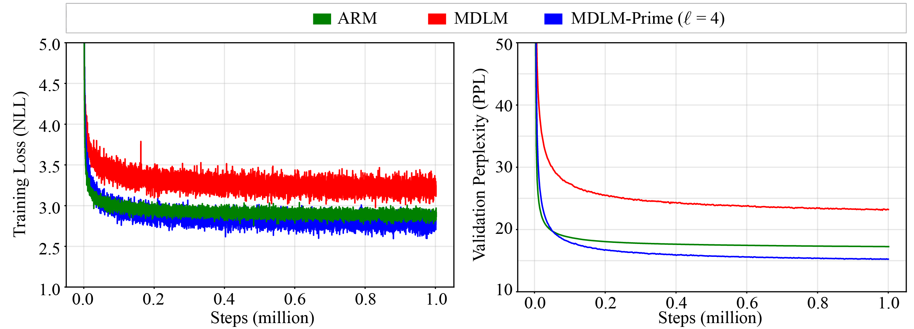

# Text Generation Experiments

[](https://arxiv.org/abs/2505.18495) [](https://huggingface.co/chen-hao-chao/mdm-prime) [](https://hub.docker.com/r/chenhaochao/mdlm-prime)


This folder contains the code implementation of the text generation experiments presented in **Section 4.1** of [our paper](https://arxiv.org/abs/2505.18495).


## Install Dependencies

You can choose to lunch our pre-built docker image or manually install the dependencies via conda:

### :whale: Docker

1. Pull our pre-built docker image:
```bash
docker pull chenhaochao/mdlm-prime:latest
```
or build a docker image locally through the following command:

```bash
docker build -t mdlm-prime:latest .
```

2. Launch the docker image at `mdm-prime/text` through the following commands:
```bash
docker run -v $(pwd):/app --rm -it --gpus all --ipc=host chenhaochao/mdlm-prime:latest
```

### :snake: Conda
    
1. Install conda environment:
```bash
# Create conda environment
conda env create -f environment.yml
conda activate mdlm-prime
# Install default dependencies via pip
pip install -r requirements.txt
```

2. Install additional dependencies via pip:
```
pip install flash-attn==2.6.3
```

<details>
<summary><strong>Possible Error Messages & Solutions</strong></summary>

**Error**. When executing `pip install -r requirements.txt`:
```bash
ERROR: Could not build wheels for faiss-cpu, which is required to install pyproject.toml-based projects
```
**Solution**. Install `faiss` using the following command and then reinstall `flash-attn` again:
```
pip install faiss-cpu==1.7.4
pip install faiss-gpu-cu12
pip install flash-attn==2.6.3
```

**Error**. When executing `pip install -r requirements.txt`:
```bash
ERROR: Could not build wheels for pyarrow, which is required to install pyproject.toml-based projects
```
**Solution**. Install `pyarrow` using the following command and then reinstall `requirements.txt` again:
```
pip install pyarrow==17.0.0
```

**Error**. When executing `pip install flash-attn==2.6.3`:
```bash
ERROR: Could not build wheels for flash_attn, which is required to install pyproject.toml-based projects
```
**Solution**. `flash-attn` requires NVIDIA Ampere or newer GPUs for installation. You may need to find compatible hardware. See [Dao-AILab/flash-attention](https://github.com/Dao-AILab/flash-attention) for more details.

**Error**. When executing the training / sampling code:
```bash
AttributeError: module 'faiss._swigfaiss' has no attribute 'delete_MaybeOwnedVectorUInt8Vector' 
```
**Solution**. Uninstall `faiss` using the following command:
```
pip uninstall faiss-cpu
pip uninstall faiss-gpu
```

</details>

## Commands

### Training

Before starting training, set up your [Weights & Biases](https://wandb.ai/site/) account by exporting the API key.

```
export WANDB_API_KEY=${your_wandb_key}
```

:pushpin: **MDLM**

```bash
python -u -m main data=openwebtext-split data.cache_dir=/app/huggingface_cache \
                  loader.batch_size=16 loader.eval_batch_size=16 model=small \
                  wandb.name=mdlm_owt checkpointing.save_dir=/app/results_mdlm_owt \
                  eval.compute_zero_shot=False eval.conditional_sampling=False \
                  eval.compute_generative_perplexity=False sampling.steps=512
```
- **Arguments:**
    - `data`: name of the dataset. (default: `openwebtext`)
    - `data.cache_dir`: path to the saving directory of data. (default: `/app/huggingface_cache`)
    - `model`: `small` / `small-ar`. (default: `small`)
    - `wandb.name`: name of the wandb run. (default: `null`)
    - `checkpointing.save_dir`: path to the saving directory of weights. (default: `${cwd:}`)
    - `eval.compute_zero_shot`: whether to evaluate zero-shot PPL during training. (default: `False`)
    - `eval.conditional_sampling`: whether to evaluate conditional sampling during training. (default: `False`)
    - `eval.compute_generative_perplexity`: whether to evaluate Gen PPL during training. (default: `False`)
    - `sampling.steps`: number of steps used for sampling. (default: `256`)


:pushpin: **MDLM-Prime**

```bash
python -u -m main data=openwebtext-split data.cache_dir=/app/huggingface_cache \
                  loader.batch_size=16 loader.eval_batch_size=16 model=small \
                  wandb.name=results_prime_l2_owt checkpointing.save_dir=/app/results_prime_l2_owt \
                  prime.target_length=2 prime.carry_over=False \
                  eval.compute_zero_shot=False eval.conditional_sampling=False \
                  eval.compute_generative_perplexity=False sampling.steps=512
```

- **Arguments:**
    - `prime.target_length`: number of sub-tokens, i.e., $\ell$. (default: `1`)
    - `prime.carry_over`: whether to enable carry-over parameterization. (default: `False`)


:pushpin: **ARM**

```bash
python -u -m main data=openwebtext-split data.cache_dir=/app/huggingface_cache \
                  loader.batch_size=16 loader.eval_batch_size=16 model=small-ar \
                  backbone=ar parameterization=ar sampling.predictor=ar \
                  wandb.name=arm_owt checkpointing.save_dir=/app/arm \
                  eval.compute_zero_shot=False eval.conditional_sampling=False \
                  eval.compute_generative_perplexity=False sampling.steps=512
```

- **Arguments:**
    - `backbone`: `dit` / `ar`. (default: `dit`)
    - `parameterization`: flag to select the design of output logits. (default: `subs`)
    - `sampling.predictor`: flag to select the designs of samplers. (default: `ddpm_cache`)

### Likelihood Evaluation

:pushpin: **Perplexity**

```
python -u -m main mode=ppl_eval eval.compute_zero_shot=True eval.generate_samples=False \
                  eval.checkpoint_path=${path_to_checkpoint} \
                  data=openwebtext-split data.cache_dir=/app/huggingface_cache \
                  loader.batch_size=16 loader.eval_batch_size=16 model=small \
                  prime.target_length=2 prime.carry_over=True
```

- **Arguments:**
    - `mode`: `train` / `ppl_eval` / `sample_and_save`. (default: `train`)
    - `eval.checkpoint_path`: path to the checkpoint. (default: ` `)

### Sampling

:pushpin: **Unconditional Sampling**

```
python -u -m main mode=sample_and_save eval.checkpoint_path=${path_to_checkpoint} \
                  sampling.split_size=100 sampling.steps=512 \
                  sampling.sampling_dir=/app/results_prime_l2_owt/samples \
                  sampling.sampling_dtype=fp64 sampling.nucleus_p=0.95 \
                  loader.eval_batch_size=25 model=small \
                  prime.target_length=2 prime.carry_over=False
```

- **Arguments:**
    - `sampling.split_size`: total number of samples of a sampling split. (default: `625`)
    - `sampling.sampling_dir`: path to the saving directory for the generated samples. (default: `/app/results`)
    - `sampling.sampling_dtype`: floating-point precision: `fp32` / `fp64`. (default: `fp32`)
    - `sampling.nucleus_p`: parameter that controls the sharpness of the output distribution in [nucleus sampling](https://arxiv.org/abs/1904.09751). (default: `1.0`)


:pushpin: **Conditional Sampling**

```
python -u -m main mode=sample_and_save eval.checkpoint_path=${path_to_checkpoint} \
                  sampling.split_size=100 sampling.steps=512 \
                  sampling.sampling_dir=/app/results_prime_l2_owt/samples \
                  sampling.sampling_dtype=fp64 sampling.nucleus_p=0.95 \
                  sampling.conditions=True sampling.prefix_len=35 \
                  data=openwebtext-split data.cache_dir=/app/huggingface_cache \
                  loader.eval_batch_size=25 model=small \
                  prime.target_length=2 prime.carry_over=False
```

- **Arguments:**
    - `sampling.conditions`: whether to provide the model with prefix information. (default: `False`)
    - `sampling.prefix_len`: length of the prefix text sequence. (default: `50`)


## Pretrained Weights

The following table (click the toggle-down button) presents the pretrained weights of different configurations:

<details>
<summary><strong>OpenWebText</strong> (OWT)</summary>

| Dataset | Model | $\ell$ | `carry_over` | Weight | `${setup_dir}` |
| ------- | ----- | ------ | ---------- | ---- | ---- |
| `OWT`   | MDLM-Prime | 2 | False | [🤗 link](https://huggingface.co/chen-hao-chao/mdm-prime/blob/main/text/owt/results_prime_l2_owt/checkpoint.ckpt) | `results_prime_l2_owt` |
|         |            |   | True  | [🤗 link](https://huggingface.co/chen-hao-chao/mdm-prime/blob/main/text/owt/results_prime_l2_co_owt/checkpoint.ckpt) | `results_prime_l2_co_owt` |
|         |            | 3 | False | [🤗 link](https://huggingface.co/chen-hao-chao/mdm-prime/blob/main/text/owt/results_prime_l3_owt/checkpoint.ckpt) | `results_prime_l3_owt` |
|         |            |   | True  | [🤗 link](https://huggingface.co/chen-hao-chao/mdm-prime/blob/main/text/owt/results_prime_l3_co_owt/checkpoint.ckpt) | `results_prime_l3_co_owt` |
|         |            | 4 | False | [🤗 link](https://huggingface.co/chen-hao-chao/mdm-prime/blob/main/text/owt/results_prime_l4_owt/checkpoint.ckpt) | `results_prime_l4_owt` |
|         |            |   | True  | [🤗 link](https://huggingface.co/chen-hao-chao/mdm-prime/blob/main/text/owt/results_prime_l4_co_owt/checkpoint.ckpt) | `results_prime_l4_co_owt` |
|         |            | 6 | False | [🤗 link](https://huggingface.co/chen-hao-chao/mdm-prime/blob/main/text/owt/results_prime_l6_owt/checkpoint.ckpt) | `results_prime_l6_owt` |
|         |            |   | True  | [🤗 link](https://huggingface.co/chen-hao-chao/mdm-prime/blob/main/text/owt/results_prime_l6_co_owt/checkpoint.ckpt) | `results_prime_l6_co_owt` |
|         |            | 8 | False | [🤗 link](https://huggingface.co/chen-hao-chao/mdm-prime/blob/main/text/owt/results_prime_l8_owt/checkpoint.ckpt) | `results_prime_l8_owt` |
|         |            |   | True  | [🤗 link](https://huggingface.co/chen-hao-chao/mdm-prime/blob/main/text/owt/results_prime_l8_co_owt/checkpoint.ckpt) | `results_prime_l8_co_owt` |

</details>

We reproduced the results using this code implementaion. The results of MDLM-Prime ($\ell=4$) are slightly better (PPL=15.21) than those reported in the main manuscript. The training and evaluation curves are shown as follows:

||
|-|

<details>
<summary><strong>Reproduced Results</strong></summary>

| Dataset | Model | Weight | `${setup_dir}` |
| ------- | ----- | ---- | ---- |
| `OWT`   | ARM                   | [🤗 link](https://huggingface.co/chen-hao-chao/mdm-prime/blob/main/text/owt/results_ar_owt_reproduce/checkpoint.ckpt) | `results_ar_owt_reproduce` |
|         | MDLM                  | [🤗 link](https://huggingface.co/chen-hao-chao/mdm-prime/blob/main/text/owt/results_mdm_owt_reproduce/checkpoint.ckpt) | `results_mdm_owt_reproduce` |
|         | MDLM-Prime ($\ell=4$) | [🤗 link](https://huggingface.co/chen-hao-chao/mdm-prime/blob/main/text/owt/results_prime_l4_owt_reproduce/checkpoint.ckpt) | `results_prime_l4_owt_reproduce` |

</details>

Click the toggle-down button :point_up: to access the weights of the reproduced results.

<br>

:pushpin: **Example Usage of Pretrained Weights**

Pass `checkpointing.from_huggingface=True` and set `eval.checkpoint_path=text/owt/${setup_dir}/checkpoint.ckpt` to download the checkpoint from our huggingface repository.

**Example.** Evalute PPL using MDLM-Prime ($\ell=2$)

```bash
python -u -m main mode=ppl_eval eval.compute_zero_shot=False eval.generate_samples=False \
                  eval.checkpoint_path=text/owt/results_prime_l2_owt/checkpoint.ckpt \
                  data=openwebtext-split data.cache_dir=/app/huggingface_cache \
                  loader.batch_size=16 loader.eval_batch_size=16 model=small \
                  prime.target_length=2 prime.carry_over=False \
                  checkpointing.from_huggingface=True
```

**Example.** Sampling using MDLM-Prime ($\ell=2$)

```bash
python -u -m main mode=sample_and_save eval.checkpoint_path=text/owt/results_prime_l2_owt/checkpoint.ckpt \
                  sampling.split_size=10 sampling.steps=512 \
                  sampling.sampling_dir=/app/results_prime_l2_owt/samples \
                  sampling.sampling_dtype=fp64 sampling.nucleus_p=0.95 \
                  loader.eval_batch_size=10 model=small \
                  prime.target_length=2 prime.carry_over=False \
                  checkpointing.from_huggingface=True
```

:pushpin: **Manually Download the Pretrained Weights**

Execute the following python code, and the downloaded files will appear in your huggingface cache directory (e.g., `~/.cache/huggingface/hub`):
```python
from huggingface_hub import hf_hub_download

checkpoint_path = hf_hub_download(
    repo_id="chen-hao-chao/mdm-prime",
    filename="text/owt/${setup_dir}/checkpoint.ckpt"
)
```

For more details, please refer to our huggingface repository: [🤗 chen-hao-chao/mdm-prime](https://huggingface.co/chen-hao-chao/mdm-prime).

## License
This code implementation is developed based on the following repository.

- [kuleshov-group/mdlm](https://github.com/kuleshov-group/mdlm) (at commit `3ecb6dc`), licensed under the `Apache-2.0` license.

Further changes based on the code in this folder are licensed under the `Apache-2.0` license.


## Citing MDM-Prime

If you find this code implementation useful, please consider citing our paper.

```bib
@inproceedings{chao2025mdmprime,
      title = {{Beyond Masked and Unmasked: Discrete Diffusion Models via Partial Masking}}, 
      author = {Chen-Hao Chao, Wei-Fang Sun, Hanwen Liang, Chun-Yi Lee, Rahul G. Krishnan},
      booktitle = {Proceedings of the Conference on Neural Information Processing Systems (NeurIPS)},
      year = {2025},
}
```
