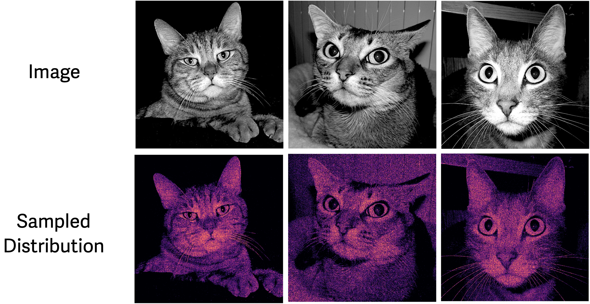
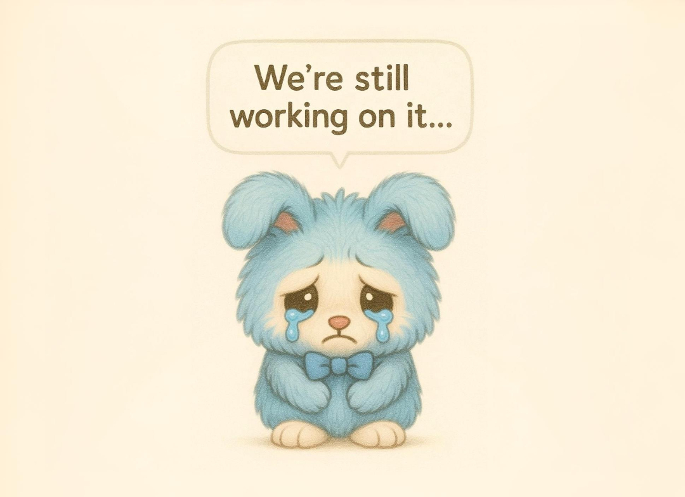

# Two-Dimensional Toy Examples

  

This folder contains the code implementation of the toy experiments presented in **Fig. 4** of [our paper](https://arxiv.org/abs/2505.18495).

> Images are from the [Cat dataset](https://www.kaggle.com/datasets/crawford/cat-dataset). Distributions are sampled using MDM-Prime with $\ell=2$.

## Coming Soon

Thank you for your interest in our project! We are currently preparing and testing the code and will be releasing it soon.

 

